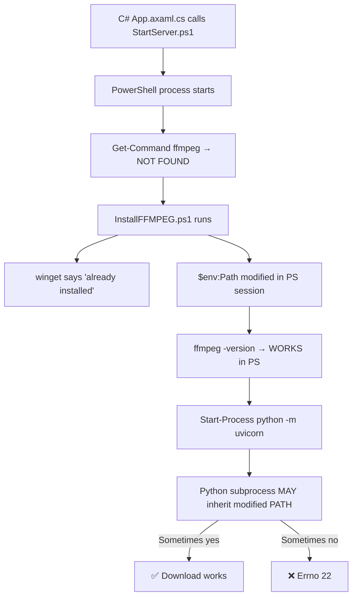

# Errno 22 (Invalid Argument) — Corrected Diagnostic Report

> [!IMPORTANT]
> **Correction**: The initial report incorrectly concluded only [.mp3](file:///c:/Users/brand/RiderProjects/PyScrapper/Downloads/b4ae6901-3116-46d2-9ef9-a86d21e089c5.mp3) downloads fail. The user provided evidence that **[.mp4](file:///c:/Users/brand/RiderProjects/PyScrapper/Downloads/c03046d5-97bc-4b43-8350-db6c15e999dd.mp4) downloads also fail with Errno 22**. This revised report reflects the true root cause.

---

## 1. The Real Pattern

Both [.mp3](file:///c:/Users/brand/RiderProjects/PyScrapper/Downloads/b4ae6901-3116-46d2-9ef9-a86d21e089c5.mp3) AND [.mp4](file:///c:/Users/brand/RiderProjects/PyScrapper/Downloads/c03046d5-97bc-4b43-8350-db6c15e999dd.mp4) YouTube downloads fail intermittently with `[Errno 22] Invalid argument`:

| Video ID | [.mp3](file:///c:/Users/brand/RiderProjects/PyScrapper/Downloads/b4ae6901-3116-46d2-9ef9-a86d21e089c5.mp3) | [.mp4](file:///c:/Users/brand/RiderProjects/PyScrapper/Downloads/c03046d5-97bc-4b43-8350-db6c15e999dd.mp4) | Source |
|---|---|---|---|
| `zwFuxHn0Vrw` | — | ❌ Errno 22 | app.log line 316 |
| `raszBtz8dmk` | — | ❌ x3 Errno 22 | app.log lines 320-328 |
| `FQZCOEgjAFg` | ❌ | — | server_runtime.log line 4 |
| `zBjJUV-lzHo` | ❌ | ✅ later | server_runtime.log lines 29, 33 |
| `s_jtWU7jxcg` | ❌ | ✅ later | server_runtime.log lines 42, 43 |
| `Ib9ijFp6uqc` | — | ✅ | server_runtime.log line 17 |

**Key observation**: Standalone yt-dlp tests of the SAME failing videos (e.g. `raszBtz8dmk`) **work perfectly** — the error is server-context-specific.

---

## 2. Root Cause: FFmpeg PATH Not Propagating to Server Process

### Evidence from [StartServer.log](file:///c:/Users/brand/RiderProjects/PyScrapper/LocalServer/logs/StartServer.log)

The server was **restarted 16 times** on 2026-03-03. **Every single time**, the log shows:

```
ffmpeg not found. Running InstallFFMPEG.ps1...
```

This happens despite FFmpeg already being installed! The reason:



### Why PATH is unreliable

1. **FFmpeg is installed via `winget`** to `%LOCALAPPDATA%\Microsoft\WinGet\Packages\yt-dlp.FFmpeg_...`
2. **[InstallFFMPEG.ps1](file:///c:/Users/brand/RiderProjects/PyScrapper/LocalServer/scripts/InstallFFMPEG.ps1)** modifies `$env:Path` (line 41) — this is process-scoped
3. **But** [StartServer.ps1](file:///c:/Users/brand/RiderProjects/PyScrapper/LocalServer/scripts/StartServer.ps1) runs InstallFFMPEG.ps1 via `& $installScript 2>&1 | Out-File` (line 52) — the PATH change happens inside the piped invocation. Whether it propagates to the parent scope depends on the invocation method
4. **`Start-Process`** (line 76) creates a NEW process. It will only inherit `$env:Path` if the modification actually stuck
5. **The C# app** launches [StartServer.ps1](file:///c:/Users/brand/RiderProjects/PyScrapper/LocalServer/scripts/StartServer.ps1) via `Process.Start()`, adding yet another layer of potential PATH loss

### Why some downloads succeed

When FFmpeg IS on PATH (from user PATH, or from a lucky session inheritance), yt-dlp finds it and downloads work. When it's NOT findable, yt-dlp's internal file operations with FFmpeg fail with `[Errno 22]`.

The intermittent nature explains why:
- **4 out of ~30 download attempts succeeded** (all [.mp4](file:///c:/Users/brand/RiderProjects/PyScrapper/Downloads/c03046d5-97bc-4b43-8350-db6c15e999dd.mp4) — which may simply be because the PATH was right during those attempts, not because of the format)
- Most attempts fail instantly (yt-dlp fails early when FFmpeg isn't available)

---

## 3. Fix Suggestions

### Fix 1 (PRIMARY) — Tell yt-dlp where FFmpeg is explicitly

Instead of relying on PATH, pass `ffmpeg_location` directly to yt-dlp:

**File:** [Youtube.py](file:///c:/Users/brand/RiderProjects/PyScrapper/PythonModule/Youtube.py)

```diff
+import shutil
+
+def _find_ffmpeg():
+    """Find ffmpeg regardless of PATH state."""
+    # 1. Check PATH
+    ff = shutil.which("ffmpeg")
+    if ff:
+        return os.path.dirname(ff)
+    # 2. Check winget install location
+    pkg_root = os.path.join(os.environ.get("LOCALAPPDATA", ""), "Microsoft", "WinGet", "Packages")
+    if os.path.isdir(pkg_root):
+        for root, dirs, files in os.walk(pkg_root):
+            if "ffmpeg.exe" in files and "yt-dlp.FFmpeg" in root:
+                return root
+    return None

 def download_audio_only(url, out_path):
     ...
     ydl_opts = {
         "format": "bestaudio/best",
         "outtmpl": out_file,
+        "ffmpeg_location": _find_ffmpeg(),
         "postprocessors": [{ ... }],
     }

 def download(url, out_path):
     ...
     ydl_opts = {
         ...
+        "ffmpeg_location": _find_ffmpeg(),
         "postprocessors": [{ ... }],
     }
```

This is the **single most impactful fix** — it removes the dependency on PATH entirely.

---

### Fix 2 — Fix StartServer.ps1 PATH propagation

**File:** [StartServer.ps1](file:///c:/Users/brand/RiderProjects/PyScrapper/LocalServer/scripts/StartServer.ps1), **line 52**

```diff
-    & $installScript -PersistUserPath 2>&1 | Out-File -Append -FilePath $LogFile -Encoding utf8
+    . $installScript -PersistUserPath 2>&1 | Out-File -Append -FilePath $LogFile -Encoding utf8
```

Using **dot-sourcing** (`.`) instead of `&` ensures `$env:Path` modifications persist in the caller's scope.

---

### Fix 3 — Add traceback logging to [server.py](file:///c:/Users/brand/RiderProjects/PyScrapper/LocalServer/server.py)

**File:** [server.py](file:///c:/Users/brand/RiderProjects/PyScrapper/LocalServer/server.py), **lines 189-200**

```diff
 except Exception as e:
+    import traceback
     response = JobResponse(
         id=job_id,
         jobtype="download",
         status="error",
-        message={"error": str(e), "url": download_request.url}
+        message={"error": str(e), "traceback": traceback.format_exc(), "url": download_request.url}
     )
```

This would have made the root cause immediately obvious from the logs.

---

### Fix 4 — Add `restrictfilenames` and `nopart` to [download_audio_only()](file:///c:/Users/brand/RiderProjects/PyScrapper/PythonModule/Youtube.py#184-216)

**File:** [Youtube.py](file:///c:/Users/brand/RiderProjects/PyScrapper/PythonModule/Youtube.py), **lines 197-205**

```diff
 ydl_opts = {
     "format": "bestaudio/best",
     "outtmpl": out_file,
+    "restrictfilenames": True,
+    "nopart": True,
     "postprocessors": [{ ... }],
 }
```

These are present in [download()](file:///c:/Users/brand/RiderProjects/PyScrapper/PythonModule/Youtube.py#218-253) but missing from [download_audio_only()](file:///c:/Users/brand/RiderProjects/PyScrapper/PythonModule/Youtube.py#184-216).

---

### Fix 5 — Bug: Unknown provider falls through

**File:** [server.py](file:///c:/Users/brand/RiderProjects/PyScrapper/LocalServer/server.py), **lines 146-153**

Missing `return` after setting error response for unknown providers.

### Fix 6 — Bug: `search_request.query` → `.search`

**File:** [server.py](file:///c:/Users/brand/RiderProjects/PyScrapper/LocalServer/server.py), **line 251**

[SearchRequest](file:///c:/Users/brand/RiderProjects/PyScrapper/LocalServer/server.py#63-67) has field [search](file:///c:/Users/brand/RiderProjects/PyScrapper/PythonModule/Youtube.py#20-98), not `query`.

### Fix 7 — Bug: Suno `.wav` replace discarded

**File:** [Suno.py](file:///c:/Users/brand/RiderProjects/PyScrapper/PythonModule/Suno.py), **line 84**

`song_url.replace(...)` result not assigned back.

---

## Summary

| # | Severity | Fix | Why |
|---|---|---|---|
| 1 | 🔴 Critical | Pass `ffmpeg_location` to yt-dlp | Eliminates PATH dependency entirely |
| 2 | 🟠 High | Dot-source [InstallFFMPEG.ps1](file:///c:/Users/brand/RiderProjects/PyScrapper/LocalServer/scripts/InstallFFMPEG.ps1) | Fixes PATH propagation to server |
| 3 | 🟡 Medium | Add traceback to error response | Essential for future debugging |
| 4 | 🟡 Medium | Add `restrictfilenames`/`nopart` | Defensive, prevents secondary issues |
| 5-7 | 🟡 Medium | Bug fixes | Prevents crashes in edge cases |
